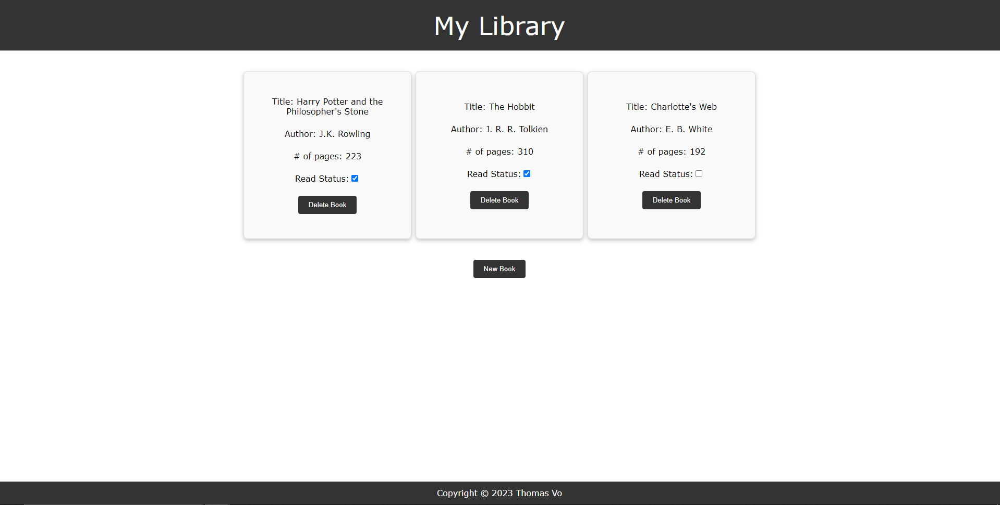

 

  <h1 align="center">Library</h1>

  

    A library manager
     
     
    <a href="https://tommyyvo30.github.io/Library/">View Demo</a>
     
     
    
  

## Built With

- 
- 
- 

## Contact

Thomas Vo - tommyyvo@gmail.com

Project Link: [https://github.com/Tommyyvo30/Library](https://github.com/Tommyyvo30/Library)

## Acknowledgments

- [Markdown Badges](https://ileriayo.github.io/markdown-badges/#usage)
